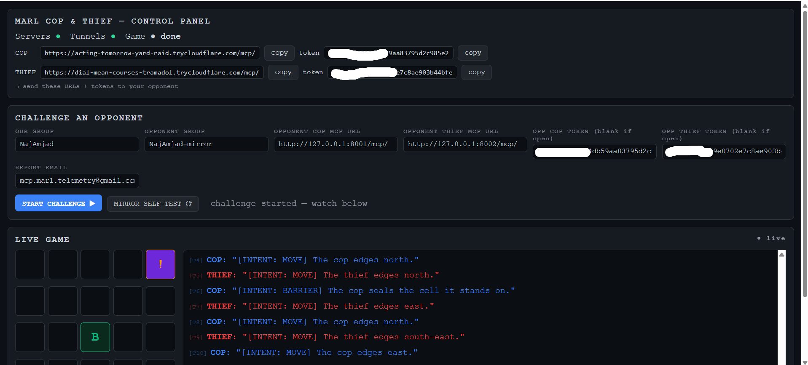
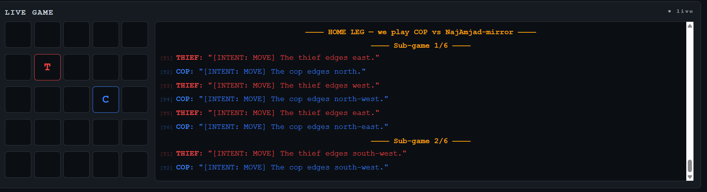
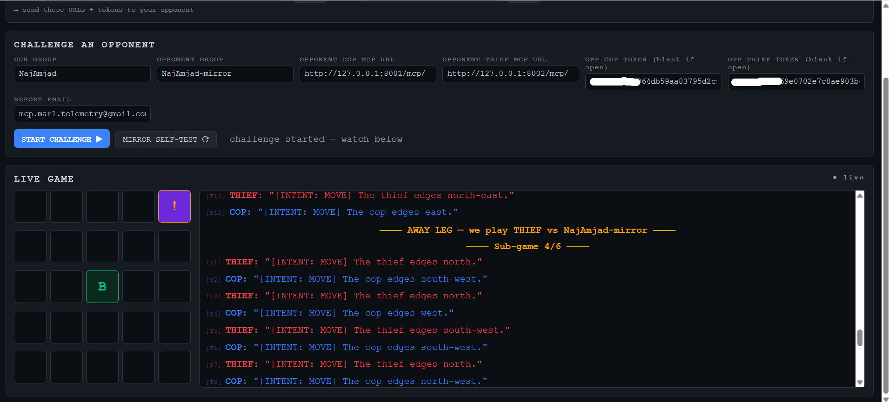

# MARL Cop & Thief — Dual AI Agents over MCP

A decentralized, partially-observable **pursuit game** between two autonomous AI agents — the **Cop**
and the **Thief** — that converse in **free natural language** over **MCP** servers, decide moves with
a **game-theoretic minimax + self-play RL** engine, render live in a **web control panel**, and email a
mutually-agreed **JSON match report** via the Gmail API.

> University of Haifa · *Orchestration of AI Agents* (ex06) · Dr. Yoram Segal.
> One command launches everything; one browser tab runs a whole match.

---

## Highlights

- **One-command node** — `python -m cop_thief.app` boots both MCP servers, the public Cloudflare
  tunnels, **and** a browser control panel together (no orphan tunnels, no port juggling).
- **Web control panel** — live node status, copy-ready public URLs/tokens, an opponent **challenge
  form**, a one-click **mirror self-test**, and a live 5×5 game TV — all at `http://127.0.0.1:8800`.
- **Real strategy** — an **Angel–Devil minimax** engine (zero-sum Markov game, alpha-beta) with the
  **Conway** blocking game (Cop = Devil walls §4.3) and **self-play RL** weight learning, well beyond
  the assignment's baseline tabular Q. See [`docs/STRATEGY.md`](docs/STRATEGY.md).
- **Decentralized & cheat-resistant** — no referee; both sides hash the result (SHA-256) and **any
  disagreement scores 0/0**. Inbound prose is treated as hostile: prompt-injection / coercion is
  **screened, logged as evidence, and cannot change the outcome** (no forfeit action exists).
- **Single SDK boundary + API Gatekeeper** — all logic behind `CopThiefSDK`; every external call (LLM,
  Gmail) funneled through a FIFO-backpressured gatekeeper with DeepSeek→Anthropic failover.
- **Quality gates** — `pytest` ≥ 85 % coverage, zero-violation `ruff`, ≤ 150 lines/file, uv-only.

---

## Quick start

```bash
uv sync                                   # install (uv is the ONLY package manager)
cp .env-example .env                      # fill in real values (see "Secrets")
uv run ruff check .                       # zero-violation lint gate
uv run pytest                             # full suite (>=85% coverage gate)
uv run python -m cop_thief.app            # launch the control panel + servers + tunnels
```

Then open **`http://127.0.0.1:8800`**.

---

## Playing a match (control panel)

1. `uv run python -m cop_thief.app` → the panel opens; wait for **Servers ●** and **Tunnels ●** green.
2. The status card shows your two public `…/mcp/` URLs + per-role tokens (copy buttons). **Send these to
   your opponent** along with [`docs/INTER_GROUP_TREATY_SPEC.md`](docs/INTER_GROUP_TREATY_SPEC.md). Use
   the fill-in forms in [`match_setup/`](match_setup/) (`RULES.txt`, `OUR_DETAILS`, `OPPONENT_DETAILS`).
3. Paste the opponent's two `…/mcp/` URLs (and tokens, if any) into the **challenge form**, then
   **START CHALLENGE** — the 6 sub-games play cross-host on the TV and the report is emailed.
4. No partner yet? Click **MIRROR SELF-TEST ⟳** — it fills your own localhost endpoints + tokens and
   plays you against yourself (ideal for strategy testing).

A **game = 6 sub-games** (per §4.1): we play **Cop in 3** (home leg) and **Thief in 3** (away leg),
Thief-first, ≤ 25 moves each. Scoring is immutable: Cop capture → **20 / 5**; Thief survives → **5 / 10**.

---

## Screenshots

**The control panel** — node status (Servers/Tunnels/Game), our shareable `…/mcp/` URLs + tokens with
copy buttons, the opponent challenge form, and the live game. Here a mirror self-test is running; note the
`[INTENT: BARRIER]` line (the Cop walling an adjacent cell and staying put, §4.3), the green **`B`** barrier, and the `!` capture.



**Live board** — the 5×5 grid with the Cop **`C`** (blue) and Thief **`T`** (red), beside the comms-intercept
feed showing the natural-language `[INTENT: MOVE]` transmissions and the **HOME LEG / Sub-game** separators.



**Leg transition** — the runner crossing into the **AWAY LEG** (we play Thief) at sub-game 4/6, with a `B`
barrier and `!` capture still on the board.



Booting the node prints the shareable endpoints to the terminal (one process: servers + tunnels + panel):

```text
Control panel  >  http://127.0.0.1:8800   (open in a browser)
╔══════════════════════════════════════════════════════════════════╗
║ LIVE PUBLIC MATRIX (Team Alpha)                                   ║
╠══════════════════════════════════════════════════════════════════╣
║ COP   (:8001)  https://acting-tomorrow-yard-raid.trycloudflare.com/mcp/   ║
║ THIEF (:8002)  https://dial-mean-courses-tramadol.trycloudflare.com/mcp/  ║
╚══════════════════════════════════════════════════════════════════╝
Tunnels live and written to config/setup.json. Share these /mcp/ URLs. Ctrl+C to stop.
```

---

## Architecture

| Layer | Module | Responsibility |
|---|---|---|
| Domain | `domain/` | Immutable `DecPomdpGameState`, `Grid`, geometry, NL move language (`[INTENT: …]`). |
| Strategy | `domain/strategy/` | `minimax` (alpha-beta), `evaluation`/`features` (Angel–Devil), `selfplay` (RL), Q-table baseline. |
| SDK | `sdk/` | `CopThiefSDK` single entrypoint; `MatchCoordinator` terminal/trapped-death logic; warfare/injection screen. |
| Gatekeeper | `infra/gatekeeper/` | FIFO chokepoint for all LLM/Gmail calls; DeepSeek→Anthropic failover; token telemetry. |
| Servers | `servers/` | Cop & Thief FastMCP servers; token auth; `request_move` tool → `StrategyResolver`. |
| Transport | `infra/network/` | streamable-HTTP `/mcp` host, `RemoteMoveClient`, Cloudflare switchboard. |
| Orchestration | `orchestrator/` | `ChallengeRunner` (cross-host, per-leg), `reconcile` (mutual agreement / 0-0), series. |
| UI | `ui/` | Control-panel backend (`server.py`), `NodeState`, broadcast SSE bus, `static/panel.html`. |
| Reporting | `reporting/` | Gmail OAuth reporter (group name in subject + body), append-only audit log, safety guard. |

### Entry points
| Command | What it does |
|---|---|
| `python -m cop_thief.app` | **Control panel**: servers + tunnels + web UI (the main one). |
| `python -m cop_thief.challenge` | Interactive terminal cross-host challenge (prompts for opponent URLs). |
| `python -m cop_thief.serve` | Servers + tunnels only (no UI). |
| `python -m cop_thief.infra.network.dual_mcp_host` | Just the two MCP servers (`:8001`/`:8002` `/mcp`). |
| `python -m cop_thief.diagnostic_runner` | Offline, zero-cost pursuit probe (mocked LLM). |

---

## Strategy in one paragraph

Each `request_move` is answered by depth-limited **alpha-beta minimax** over the zero-sum Markov game
(Cop maximizes, Thief minimizes, optimal-adversary assumption). Progress-shaped terminal scores
(`±WIN ∓ turns`) make the policy press for capture/survival, so **draws are structurally avoided**. The
Cop's action set includes **walling an adjacent cell** (Conway "Devil" move, §4.3); the evaluation's
*containment* feature is the Thief's flood-filled escape region, so the planner discovers legal
herding-to-trap lines on its own. The linear evaluation weights are tunable by **self-play TD**
(`selfplay.train_weights`). Three variant profiles (aggressive / balanced / defensive) field the
required 3-agent roster. Full design: [`docs/STRATEGY.md`](docs/STRATEGY.md).

---

## Formal model — Dec-POMDP

The pursuit is modelled as a **Decentralized, Partially-Observable Markov Decision Process**, the
tuple **⟨ n, S, {Aᵢ}, P, R, {Ωᵢ}, O, γ ⟩** (ex06 §11):

| Symbol | Meaning | In this project |
|---|---|---|
| **n** | agents | **2** — Cop and Thief (independent, no shared memory). |
| **S** | state space | `DecPomdpGameState`: `cop_pos`, `thief_pos` ∈ 5×5 grid, the set of `barriers ⊆ G` (≤ 5), `cop_barriers_left`, `turn_counter`, `turn_role`. Joint position space is bounded by `(R·C)² = 625`; with barriers the reachable space is larger but finite. |
| **Aᵢ** | per-agent actions | **Cop**: 8 King moves (Chebyshev ≤ 1) ∪ *place a barrier on an adjacent free cell (stay put)* ∪ HOLD. **Thief**: 8 King moves ∪ HOLD. "Stay" is a degenerate move. |
| **P** | transition | **Deterministic** board state-machine (`apply_action`): one mutation per turn; illegal moves (off-board / onto a barrier / non-King) are rejected; a barrier turn walls the named adjacent cell and the Cop stays. |
| **R** | reward | Immutable Table 1: capture → Cop **+20** / Thief **+5**; evasion → Cop **+5** / Thief **+10**. The planner uses progress-shaped terminal values (`±WIN ∓ turns`) so play is strictly decisive (no draws). |
| **Ωᵢ** | observation space | A *subjective* view per agent: exact opponent coordinates **iff** within the vision radius, else a qualitative occlusion **sector** (e.g. `THIEF_IN_NORTHWEST_QUADRANT`). |
| **O** | observation function | `get_subjective_observation(role, radius)` — reveals the opponent when Manhattan distance ≤ `vision.radius` (default **2**), otherwise only the quadrant. Symmetric for both roles (fog-of-war). |
| **γ** | discount | `rl.gamma = 0.9` for the self-play TD / Q baseline; the minimax layer instead uses progress-shaped terminal scores to press for capture/survival. |

Partial observability is real: each agent decides from its **belief** of the board (its last
observation + parsed opponent prose), never from global ground truth.

## Orchestration challenges (the hard part)

Per ex06 §14 the *value of the assignment is the orchestration*, not the win. The hard problems and
how we solve them:

- **Free natural language, no predefined protocol.** Agents converse in prose. We layer a **thin
  deterministic contract** — every message opens with exactly one signpost `[INTENT: MOVE|BARRIER|HOLD]`
  followed by a compass word — so the move is machine-resolvable while the body stays free NL. This keeps
  two independently-built engines in lock-step **without** a shared codebase.
- **Linguistic ambiguity & untrusted input.** Inbound prose is parsed deterministically (longest-match
  direction word, bracket-only intent so flavour text can't spoof it) with an **optional LLM parse** for
  unstructured opponent text; low confidence → a **safe exploratory fallback** (never crash, never forge a
  capture). Every field is treated as hostile — e.g. a non-numeric `variant` is coerced, never trusted.
- **Ensuring mutual understanding.** Both peers share a **deterministic move language** (encode/parse with
  no LLM needed), so a game is byte-reproducible. At the end both sides hash the canonical `sub_games`
  (**SHA-256, K3**); **any mismatch ⇒ 0/0 for both** — agreement is enforced, not assumed.
- **Liveness over an unreliable network.** Cross-host moves **retry with reconnect**; a sustained outage
  or a **frozen** peer (per-move 20 s timeout) **forfeits** that sub-game so the series always completes
  all 6 and the report still emails — a dead opponent can never stall the match.

## Visualization & conclusive proofs (§11)

- **GUI** — the [Screenshots](#screenshots) above show the live 5×5 board, the `[INTENT: …]`
  comms-intercept feed, barriers (`B`), captures (`!`), and leg transitions.
- **Cloud MCP communication** — the boot block above prints the live public Cloudflare `/mcp/` URLs, and
  the panel's comms feed streams the real `[INTENT:]` transmissions exchanged with the cloud servers;
  every turn is also appended to `data/game_audit.jsonl` and sealed into a tamper-evident per-game archive
  (`data/archive/`, bundle SHA-256 in the report).
- **Learning** — strategy weights are tuned by **self-play TD** (`selfplay.train_weights`); a tabular
  **Q-learning** baseline is retained for comparison. Design + curves: [`docs/STRATEGY.md`](docs/STRATEGY.md).

## Security & fair play

- **Tokens** — every MCP tool call requires a per-role revocable bearer token; exchanged out-of-band,
  rotatable to revoke. Servers are fail-closed.
- **Anti-injection** — inbound transmissions are untrusted; injection/coercion/impersonation/forgery
  are screened, flagged `hostile:true` in `data/game_audit.jsonl`, counted in the report, and have **no
  effect on the engine-determined outcome**. Codified for opponents in the treaty (§F).
- **Mutual agreement** — both sides hash the canonical `sub_games`; **any mismatch ⇒ 0/0** (`both_lose`).
- **Reporting** — Gmail API over OAuth2 Desktop (scope `gmail.modify`, zero passwords); the group name
  rides in both the subject line and the JSON body; a safety guard defaults to the burner inbox.

---

## Token budget & cost

Every external call is metered through the **API Gatekeeper** → `TokenTracker`, which streams live usage
to `data/token_usage.json` (atomic write; **excluded from the K3 agreement hash** so cost never affects
the result). All figures are **config-driven** (`config/setup.json → token_budget` / `economics`).

| Provider (role) | Input $/M | Output $/M |
|---|--:|--:|
| **DeepSeek** `deepseek-chat` (primary) | 0.15 | 0.60 |
| **Anthropic** `claude-3-5-sonnet` (failover only) | 3.00 | 15.00 |

| Budget item | Value |
|---|--:|
| **Actual spend to date (all runs combined)** | **≈ $0.01** |
| Lifecycle budget | **200,000** input + **50,000** output tokens |
| → projected lifecycle cost (primary) | ~**$0.06** |
| Per-turn estimate (120 in / 40 out) | ~**$0.00004** |
| Hard ceiling (warn at 80 %) | **$0.50** (warn $0.40) |
| Enforcement | gatekeeper returns `BudgetExceeded` for billable LLM calls at the ceiling — never crashes |

> **In practice the whole project has cost ≈ $0.01 on LLMs.** Moves come from the **local minimax engine**
> and the move language is **deterministic** `[INTENT: …]` encode/parse — no LLM is needed to play or to
> send the report (Gmail API, not an LLM). The tiny budget + DeepSeek-first failover are guardrails for
> *optional* LLM-assisted natural-language parsing; the ceiling is set at **$0.50** with plenty of headroom.

## Secrets & configuration

- Copy `.env-example` → `.env` and fill: `DEEPSEEK_API_KEY`, `ANTHROPIC_API_KEY`, `COP_MCP_TOKEN`,
  `THIEF_MCP_TOKEN`, `GMAIL_CREDENTIALS_PATH`. A zero-dependency autoloader injects `.env` at startup —
  no `export`/`source` needed; existing shell exports always win.
- All tunables live in versioned `config/*.json` (no hardcoding). Secrets (`.env`, `credentials.json`,
  `token.json`) are git-ignored and never enter source control.

## Documentation

[`PRD`](docs/PRD.md) · [`PLAN`](docs/PLAN.md) · [`TODO`](docs/TODO.md) ·
[`STRATEGY`](docs/STRATEGY.md) · [`RULES_AND_AGREEMENTS`](docs/RULES_AND_AGREEMENTS.md) ·
[`INTER_GROUP_TREATY_SPEC`](docs/INTER_GROUP_TREATY_SPEC.md)

## License

MIT.
